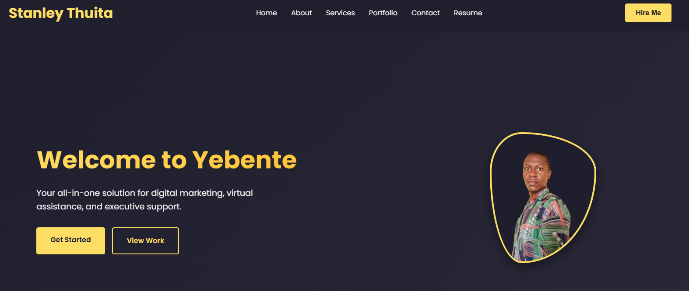
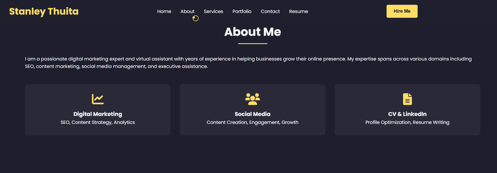
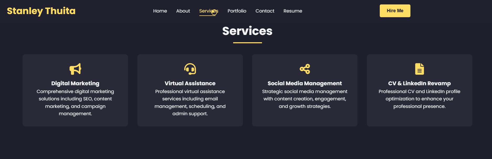
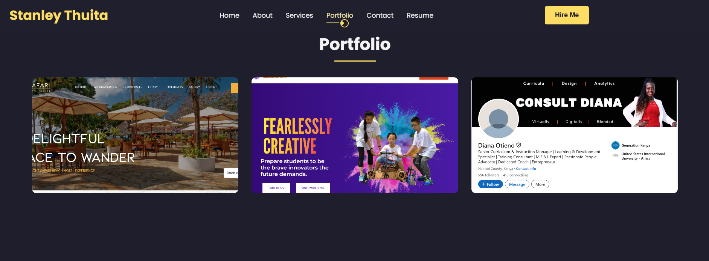
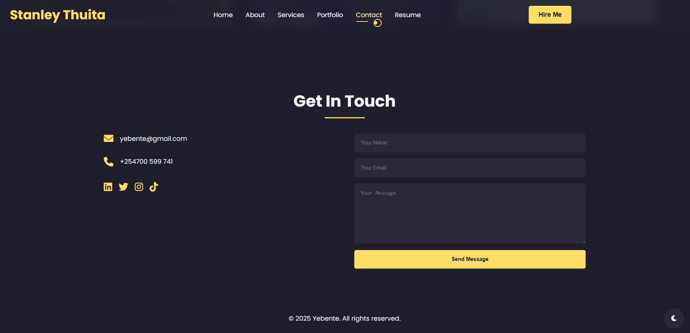

# 🌟 **Yebente Portfolio Website**

Welcome to the **Yebente** professional portfolio — a dynamic and responsive personal website showcasing expertise in digital marketing, virtual assistance, executive support, CV revamping, and social media management.

🔗 **Live Preview**: [yebente.github.io](https://yebente.github.io)

---

## 📌 **Table of Contents**
- [About](#about)
- [Technologies Used](#technologies-used)
- [Website Sections](#website-sections)
  - [🏠 Home](#-home)
  - [🙋‍♀️ About Me](#-about-me)
  - [🛠️ Services](#-services)
  - [🖼️ Portfolio](#-portfolio)
  - [📞 Contact](#-contact)
- [📁 Project Structure](#project-structure)
- [📥 How to Use This Code](#-how-to-use-this-code)
- [📬 Contact Me](#-contact-me)
- [📸 Screenshots](#-screenshots)

---

## 💡 **About**
**Yebente** is your go-to solution for growing your digital brand. This portfolio showcases projects and services tailored to:

- 🌍 Digital Marketing
- 👩‍💼 Virtual Assistance
- 🧾 Executive Support
- 📄 CV & LinkedIn Optimization
- 📱 Social Media Management

---

## 🛠️ **Technologies Used**
| Language | Usage |
|----------|--------|
| HTML5    | Structure of the website |
| CSS3     | Styling, layout, responsiveness, and animations |
| JavaScript | Interactive behavior, navigation toggle, form animations |

📁 All images used are stored in the `images/` folder.

---

## 🧩 **Website Sections**

### 🏠 Home
- Welcome message and brief overview
- Animated intro using CSS keyframes
- Call-to-action buttons




---

### 🙋‍♀️ About Me
- Personal introduction and mission
- Icons for skill areas (marketing, social media, CV revamp)
- Responsive layout with skill cards



---

### 🛠️ Services
- Clean grid layout
- Iconic cards for each service offered
- Hover effects and clear typography



---

### 🖼️ Portfolio
- Projects with visual previews
- Overlay effects for project descriptions
- Organized in a flexible responsive grid



---

### 📞 Contact
- Contact info section with icons for email and phone
- Integrated social media links with brand icons
- Simple form with placeholder values and button styling



---

## 📁 Project Structure
```bash
📦 Yebente-Portfolio
├── 📁 images              # All images used (profile, portfolio, etc.)
├── 📄 index.html          # Main HTML page
├── 📄 style.css           # Custom CSS styling
├── 📄 script.js           # JavaScript for interactions
├── 📄 Resume.pdf          # Downloadable resume
└── 📄 README.md           # This file
```

---

## 📥 **How to Use This Code**

This project is open for public use and customization. Follow the steps below to download and run it:

### 🧷 Clone the Repository
```bash
git clone https://github.com/yebente/yebente.github.io.git
```

Or download it directly:
1. Visit the repository: [yebente.github.io](https://github.com/yebente/yebente.github.io)
2. Click the green **"Code"** button.
3. Choose **"Download ZIP"** to save it locally.
4. Extract the ZIP file and open the `index.html` file in your browser to view.

### 📁 Customize
- Edit `index.html` to change content.
- Replace images in the `images/` folder.
- Update `style.css` to match your branding.
- Modify `script.js` for extra functionality.

---

⭐ **Don’t forget to star the repo and follow me for more!** 
👉 [Visit My GitHub Profile](https://github.com/yebente)

---

## 📬 **Contact Me**
You can reach out through any of the following:

📧 **Email**: yebente@gmail.com  
📞 **Phone**: +254700 599 741  
🔗 **Socials**:
- [LinkedIn](https://www.linkedin.com/in/stanmobitech)
- [Twitter](https://twitter.com/stanmobitech)
- [Instagram](https://www.instagram.com/stanmobitech/?hl=en)
- [TikTok](https://www.tiktok.com/@5tan_lee)

---

## 📸 **Screenshots**
Replace the following placeholders with real images:

- ''
- ''
- ''
- ''
- ''

📸 Screenshots help users preview each section before visiting.

---

## 🙌 **Contributions & Feedback**
Feel free to fork this repo, open issues, or contribute suggestions via pull requests.

---

## ✅ **License**
© 2025 Yebente. All rights reserved.

---

Made with ❤️ by <a href ="https://www.linkedin.com/in/stanmobitech/">**Stan**</a>